# 📔 AI Denník

> Inteligentná mobilná aplikácia pre denníkové zápisky s integrovanou umelou inteligenciou (Google Gemini).

Aplikácia umožňuje užívateľom viesť osobný denník, ktorý je obohatený o AI funkcie – automatické tagovanie zápiskov, generovanie reflexných otázok, konverzáciu s denníkom a týždenné AI zhrnutia.

**Semestrálny projekt – Funkčné softvérové riešenie s intenzívnym využitím LLM nástrojov**

---

## 📋 Obsah

- [Účel projektu](#-účel-projektu)
- [Hlavné funkcie](#-hlavné-funkcie)
- [Použité technológie](#-použité-technológie)
- [Štruktúra projektu](#-štruktúra-projektu)
- [Inštalácia a spustenie](#-inštalácia-a-spustenie)
- [Snímky obrazoviek](#-snímky-obrazoviek)
- [Reflexia LLM nástrojov](#-reflexia-llm-nástrojov)
- [Autor](#-autor)

---

## 🎯 Účel projektu

**AI Denník** rieši konkrétny use case: pomáha užívateľom **viesť osobný denník s pridanou hodnotou AI**, ktorá ich zápiskom dáva nový rozmer. Klasické denníkové aplikácie sú len text + dátum. Tu AI:

- **Analyzuje obsah** zápiskov a automaticky ich kategorizuje
- **Generuje otázky na zamyslenie** podľa toho, čo užívateľa práve trápi
- **Pomáha pri sebareflexii** cez konverzačný interface
- **Vytvára týždenné súhrny** s pozorovaniami a odporúčaniami

Cieľová skupina: ľudia, ktorí chcú písať denník, ale potrebujú motiváciu a pomoc pri reflexii.

---

## ✨ Hlavné funkcie

### 🔐 Autentifikácia a profil
- Registrácia a prihlásenie cez email/heslo (Firebase Authentication)
- Personalizovaný onboarding s nastavením používateľského mena
- Bezpečné izolovanie dát – každý užívateľ vidí len svoje zápisky

### 📝 Denníkové zápisky (CRUD)
- Vytvorenie zápisku s textom a výberom nálady (5-stupňová škála s emoji)
- Chronologický zoznam zápiskov s vyhľadávaním a filtrovaním
- Filter zápiskov podľa nálady (filter chipy)
- Detailný pohľad s formátovaným dátumom v slovenčine
- Vymazanie zápisku s potvrdením

### 🤖 AI funkcie (Google Gemini 2.5 Flash)
1. **Automatické tagovanie** – AI extrahuje 2-3 hlavné témy zo zápisku (napr. "práca, stres, oddych")
2. **Denná reflexná otázka** – Personalizovaná otázka generovaná na základe posledných zápiskov
3. **Chat s denníkom** – Konverzačný interface, kde sa užívateľ pýta AI otázky o svojich zápiskoch (s ukladaním histórie do Firestore)
4. **Týždenná self-reflexia** – Štruktúrované AI zhrnutie posledných 7 dní (prehľad, hlavné témy, pozorovania, odporúčania)

### 🔥 Motivácia
- **Streak counter** – počítadlo dní po sebe so zápiskami priamo na home obrazovke

### 📊 Štatistiky
- Súhrnné karty (celkový počet zápiskov, priemerná nálada, počet zápiskov tento týždeň, najlepšia nálada)
- Graf nálady za posledných 14 dní (Line chart s emoji na osi)
- Top 5 najčastejších tém s vizualizáciou počtu výskytov

### 🎨 Personalizácia
- **Prepínateľná tmavá/svetlá téma** s ikonou v app bare

### 🔒 Bezpečnosť
- **Firestore Security Rules** zabezpečujú, že každý užívateľ pristupuje len ku svojim dátam
- API kľúče sú v `.env` súbore (mimo Gitu cez `.gitignore`)

---

## 🛠 Použité technológie

### Frontend
| Technológia | Verzia | Použitie |
|-------------|--------|----------|
| **Flutter** | 3.41+ | Cross-platform mobilný framework |
| **Dart** | 3.5+ | Programovací jazyk |
| **Material 3** | Najnovšia | UI design system (`useMaterial3: true`) |

### Backend & Cloud
| Služba | Použitie |
|--------|----------|
| **Firebase Authentication** | Správa užívateľov, prihlasovanie email/heslo |
| **Cloud Firestore** | NoSQL databáza pre zápisky, user profily, chat históriu |
| **Firebase Security Rules** | Zabezpečenie dát na úrovni databázy |

### AI integrácia
| Služba | Model | Použitie |
|--------|-------|----------|
| **Google Gemini API** | gemini-2.5-flash | LLM pre všetky AI funkcie aplikácie |

### Flutter balíky (závislosti)
```yaml
firebase_core: ^3.8.0
firebase_auth: ^5.3.3
cloud_firestore: ^5.5.0
http: ^1.2.2
fl_chart: ^0.69.2
intl: ^0.19.0
flutter_dotenv: ^5.2.1
```

### Vývojové nástroje
| Nástroj | Použitie |
|---------|----------|
| **Cursor IDE** | Hlavný editor s integrovaným Claude Sonnet 4.5 |
| **Claude (claude.ai)** | Web chat pre plánovanie a debugging |
| **Android Studio** | Android SDK manager + Device Manager |
| **Android emulátor** | Pixel 8a, Android 15 (API 35) – primárne testovacie zariadenie |
| **Git + GitHub** | Verzionovanie a hosting repozitára |
| **Firebase CLI + FlutterFire CLI** | Konfigurácia Firebase v Flutter projekte |
| **Node.js LTS** | Potrebné pre Firebase tooling |

---

## 📂 Štruktúra projektu

```
ai_diary/
├── lib/                            # Zdrojový kód Flutter aplikácie
│   ├── main.dart                   # Vstupný bod, Firebase init, theme management
│   ├── firebase_options.dart       # Auto-generated Firebase config
│   ├── models/
│   │   └── entry_model.dart        # Dátový model zápisku
│   ├── services/
│   │   ├── auth_service.dart       # Firebase Auth wrapper
│   │   ├── firestore_service.dart  # CRUD pre zápisky, chat, user profile, streak
│   │   └── gemini_service.dart     # Gemini API integrácia (4 features)
│   ├── screens/
│   │   ├── login_screen.dart       # Prihlasovacia obrazovka
│   │   ├── register_screen.dart    # Registračná obrazovka
│   │   ├── set_username_screen.dart # Onboarding – nastavenie mena
│   │   ├── home_screen.dart        # Home s bottom nav + AI cards + streak
│   │   ├── new_entry_screen.dart   # Vytvorenie zápisku + auto-tagovanie
│   │   ├── entries_list_screen.dart # Zoznam + search + filter
│   │   ├── entry_detail_screen.dart # Detail zápisku + delete
│   │   ├── chat_screen.dart        # AI chat s denníkom (s persistenciou)
│   │   ├── weekly_summary_screen.dart # AI týždenná reflexia
│   │   └── stats_screen.dart       # Štatistiky + graf nálady
│   └── widgets/
│       └── mood_selector.dart      # Výber nálady (5 emoji)
├── docs/                           # Dokumentácia
│   ├── llm_reflection.md           # Reflexia použitia LLM nástrojov (bod 6)
│   └── screenshots/                # Snímky obrazoviek aplikácie
├── android/                        # Android-specific config
├── ios/                            # iOS-specific config
├── .env                            # API kľúč Gemini (NIE V GITE!)
├── .gitignore                      # Vylúčené súbory (vrátane .env)
├── pubspec.yaml                    # Flutter závislosti
└── README.md                       # Tento dokument
```

---

## 🚀 Inštalácia a spustenie

### Požiadavky na prostredie

| Požiadavka | Verzia | Inštalácia |
|------------|--------|------------|
| Flutter SDK | 3.41+ | [docs.flutter.dev/get-started](https://docs.flutter.dev/get-started/install) |
| Android Studio | Latest | [developer.android.com/studio](https://developer.android.com/studio) |
| Android emulátor | API 33+ | Cez Android Studio Device Manager |
| Node.js | LTS (20+) | [nodejs.org](https://nodejs.org) |
| Git | Latest | [git-scm.com](https://git-scm.com) |
| Firebase účet | Free | [firebase.google.com](https://firebase.google.com) |
| Google AI Studio účet | Free | [aistudio.google.com](https://aistudio.google.com) |

### Krok 1: Klonovanie repozitára

```bash
git clone https://github.com/aaqwaar/ai-diary.git
cd ai-diary
```

### Krok 2: Inštalácia Flutter závislostí

```bash
flutter pub get
```

### Krok 3: Setup Firebase

1. Vytvor nový projekt na [console.firebase.google.com](https://console.firebase.google.com)
2. V projekte aktivuj:
   - **Authentication** → Sign-in method → Enable **Email/Password**
   - **Firestore Database** → Create database → Production mode → Region `eur3`
3. V Firestore prejdi na záložku **Rules** a vlož:

```javascript
rules_version = '2';
service cloud.firestore {
  match /databases/{database}/documents {
    match /users/{userId} {
      allow read, write: if request.auth != null && request.auth.uid == userId;
      
      match /entries/{entryId} {
        allow read, write: if request.auth != null && request.auth.uid == userId;
      }
      
      match /chat_messages/{messageId} {
        allow read, write: if request.auth != null && request.auth.uid == userId;
      }
    }
  }
}
```

4. Nainštaluj FlutterFire CLI a prepoj projekt:

```bash
npm install -g firebase-tools
firebase login
dart pub global activate flutterfire_cli
flutterfire configure
```

Pri konfigurácii vyber svoj Firebase projekt a platformy **android** + **ios**.

### Krok 4: Nastavenie Gemini API kľúča

1. Choď na [aistudio.google.com](https://aistudio.google.com)
2. **Get API key** → **Create API key**
3. V koreňovom priečinku projektu vytvor súbor **`.env`**:

```
GEMINI_API_KEY=tvoj_api_kluc_sem
```

⚠️ Súbor `.env` je v `.gitignore` – nebude push-nutý do verejného repozitára.

### Krok 5: Spustenie

1. Spusti Android emulátor cez Android Studio → Device Manager
2. V termináli v koreňovom priečinku:

```bash
flutter run
```

Pri prvom spustení Gradle stiahne závislosti (5-15 minút). Ďalšie spustenia sú rýchle.

### Krok 6: Použitie

1. **Zaregistruj sa** s emailom a heslom
2. **Nastav si meno** v onboarding obrazovke
3. **Vytvor zápisok** kliknutím na ➕
4. AI automaticky vygeneruje tagy
5. Skús ostatné AI funkcie: dennú otázku, chat, týždennú reflexiu, štatistiky

---

## 📸 Snímky obrazoviek

### 🔐 Začiatok cesty – autentifikácia a onboarding

Aplikácia začína klasickým prihlasovacím flow s validáciou vstupov. Pri prvej registrácii prejde užívateľ jednoduchým onboardingom, kde si zvolí meno, ktorým ho bude appka volať.

<table>
  <tr>
    <td width="33%" align="center">
      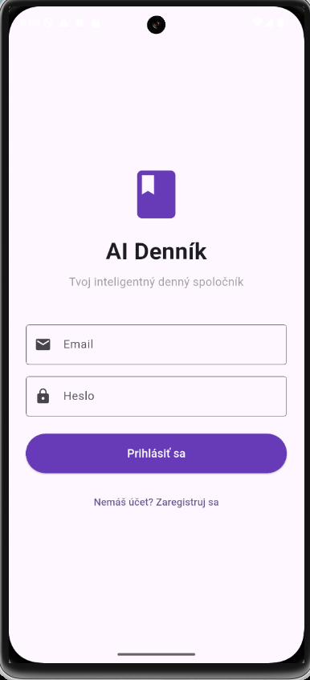<br>
      <b>Prihlásenie</b>
    </td>
    <td width="33%" align="center">
      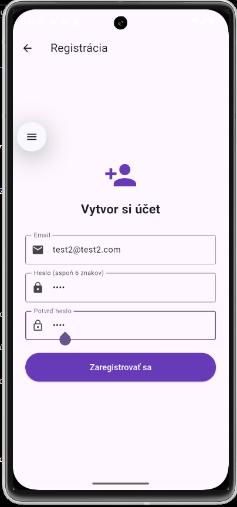<br>
      <b>Registrácia</b>
    </td>
    <td width="33%" align="center">
      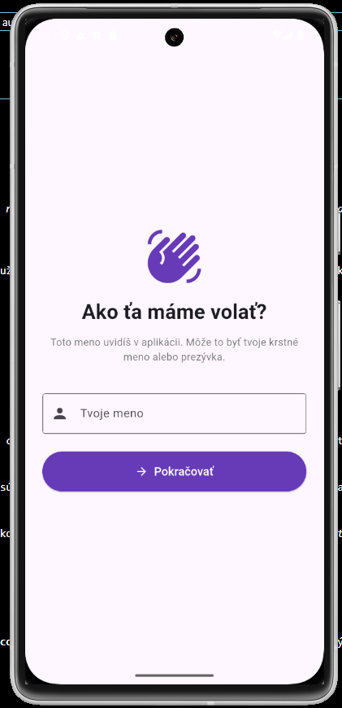<br>
      <b>Nastavenie mena</b>
    </td>
  </tr>
</table>

**Prihlásenie**
Štandardný login s emailom a heslom. Pri zlých údajoch sa pod formulárom zobrazí farebne odlíšená chybová hláška s ikonkou. Heslo je maskované, k registrácii vedie odkaz pod tlačidlom.

**Registrácia**
Tri polia – email, heslo, potvrdenie hesla. Klientská validácia kontroluje, že heslá sa zhodujú a sú aspoň 6 znakov. Po úspechu sa zobrazí zelený snackbar a užívateľ je presmerovaný späť na login.

**Nastavenie mena**
Onboarding obrazovka, ktorá sa zobrazí len pri prvom prihlásení. Užívateľ si zvolí meno (2-20 znakov), ktoré sa neskôr používa v privítaní (*"Vitaj späť, Dominik! 👋"*). Meno sa ukladá do Firestore do `users/{userId}` dokumentu.

---

### 🏠 Domovská obrazovka – centrum všetkých AI funkcií

Po prihlásení sa užívateľ ocitne na domovskej obrazovke. Vrchnú časť tvorí privítanie so **streak counterom** (počítadlo dní po sebe so zápiskami), ktorý motivuje k pravidelnému používaniu. Pod ňou sú karty s prístupom k všetkým AI funkciám.

---

### 🏠 Domovská obrazovka – centrum všetkých AI funkcií

Po prihlásení sa užívateľ ocitne na domovskej obrazovke. Vrchnú časť tvorí privítanie so **streak counterom** (počítadlo dní po sebe so zápiskami), ktorý motivuje k pravidelnému používaniu. Pod ňou sú karty s prístupom k všetkým AI funkciám.

<table>
  <tr>
    <td width="50%" align="center">
      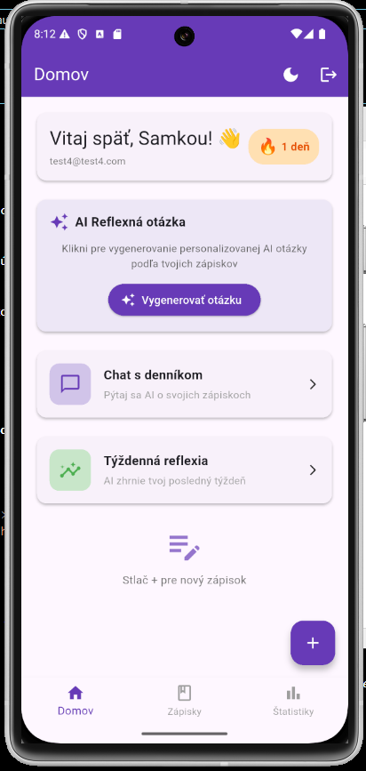<br>
      <b>Domov pred vygenerovaním otázky</b>
    </td>
    <td width="50%" align="center">
      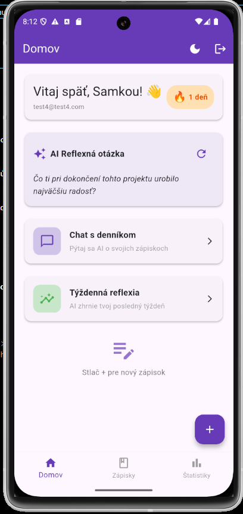<br>
      <b>Domov s aktívnou AI otázkou</b>
    </td>
  </tr>
</table>

**Domov pred vygenerovaním otázky**
Privítacia karta zobrazuje meno užívateľa, email a oranžový badge so streakom (🔥 X dní). Pod ňou je karta AI Reflexnej otázky s tlačidlom *"Vygenerovať otázku"* – AI sa zámerne nespúšťa automaticky, aby sa šetril API limit. Ďalšie karty (Chat s denníkom, Týždenná reflexia) sú prístupné cez tap.

**Domov s aktívnou AI otázkou**
Po kliknutí na *"Vygenerovať otázku"* AI analyzuje posledné zápisky a vygeneruje **personalizovanú otázku na zamyslenie**. Príklad: *"Ako vieš najlepšie nájsť úľavu, keď sa cítiš preťažený?"* Otázka sa dá kedykoľvek obnoviť cez refresh ikonu vpravo hore v karte.

V app bare vpravo hore sú **dve ikony**: prepínač tmavá/svetlá téma a logout.

---

### 📝 Denníkové zápisky – jadro aplikácie

Vytvorenie zápisku trvá pár sekúnd. Užívateľ vyberie náladu cez emoji a napíše text. Po uložení AI v pozadí extrahuje hlavné témy a uloží ich ako tagy.

<table>
  <tr>
    <td width="33%" align="center">
      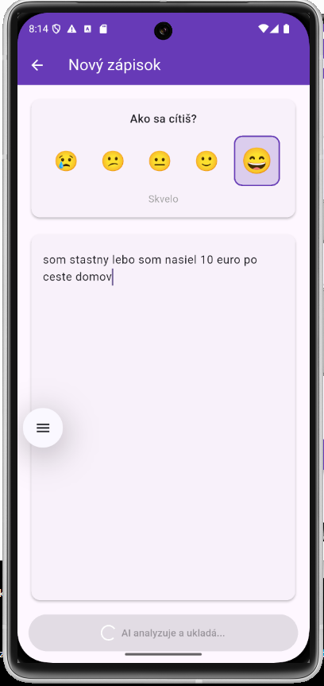<br>
      <b>Nový zápisok</b>
    </td>
    <td width="33%" align="center">
      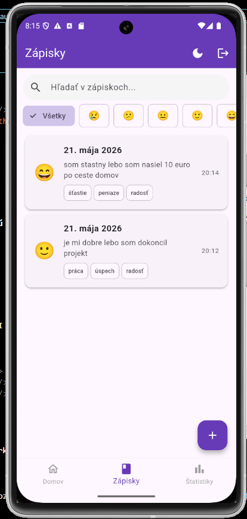<br>
      <b>Zoznam zápiskov</b>
    </td>
    <td width="33%" align="center">
      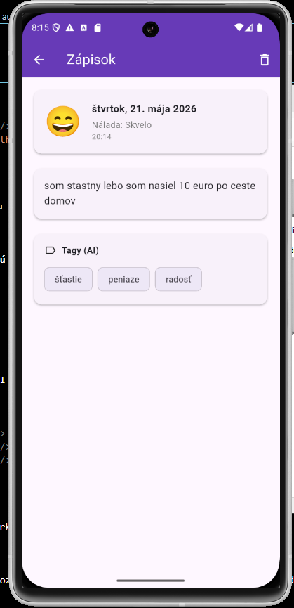<br>
      <b>Detail zápisku</b>
    </td>
  </tr>
</table>

**Nový zápisok** 
Hore karta s **mood selectorom** – 5 emoji od 😢 po 😄, kde vybraná položka je zväčšená a podčiarknutá fialovým rámčekom. Pod ňou rozšíriteľná textová oblasť pre samotný zápisok. Pri tlačidle *"Uložiť zápisok"* AI cez Gemini analyzuje text a extrahuje tagy.

**Zoznam zápiskov so search a filtrami** 
Vrchol obrazovky tvorí vyhľadávacie pole (hľadá v texte zápiskov aj v AI tagoch) a horizontálny zoznam filter chipov pre nálady (😢 😕 😐 🙂 😄). Pod ním zoznam zápiskov v kartách – každá zobrazuje emoji nálady, dátum v slovenčine, prvé dve vety textu, AI tagy a čas. Tap na zápisok otvorí detail.

**Detail zápisku** 
Plný pohľad na jeden zápisok – veľké emoji nálady, plný dátum (*"štvrtok, 19. mája 2026"*), čas, kompletný text bez orezania, samostatná sekcia *"Tagy (AI)"* s farebnými chip badgmi. Ikona koša v app bare otvára dialóg na potvrdenie vymazania.

---

### 🤖 AI funkcie – kde sa Gemini ukáže

Najviac inovatívnou časťou aplikácie sú dve veľké AI obrazovky – konverzačný chat a štruktúrovaná týždenná reflexia.

<table>
  <tr>
    <td width="50%" align="center">
      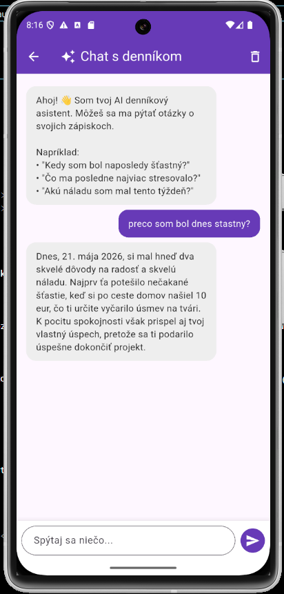<br>
      <b>Chat s denníkom</b>
    </td>
    <td width="50%" align="center">
      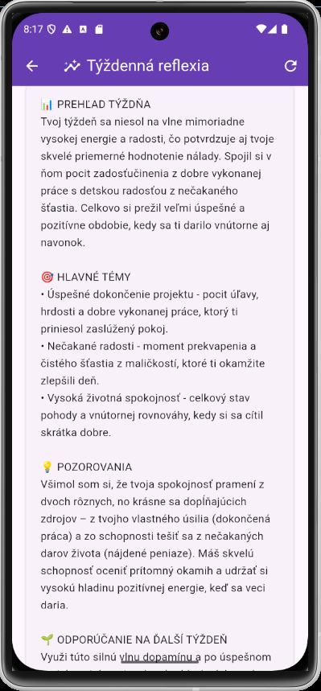<br>
      <b>Týždenná AI reflexia</b>
    </td>
  </tr>
</table>

**Chat s denníkom** 
Klasický chat UI s message bubble systémom – fialové bubliny vpravo sú užívateľove správy, sivé vľavo sú AI odpovede. AI dostáva ako kontext posledných 20 zápiskov, takže odpovedá osobne a vie sa odvolávať na konkrétne dni (*"Vidím, že tvoje zápisky z 19. mája ukazujú..."*). **História chatu sa ukladá do Firestore** – pri opätovnom otvorení appky zostáva celá konverzácia zachovaná. V app bare je ikona koša na vymazanie celej histórie.

**Týždenná AI reflexia**  
Generovaná na požiadanie cez kartu na home screene. AI analyzuje všetky zápisky z posledných 7 dní a vytvorí **štruktúrované zhrnutie** so 4 sekciami označenými emoji:
- 📊 **Prehľad týždňa** – celkový charakter týždňa, dominantné nálady
- 🎯 **Hlavné témy** – odrážkový zoznam tém, ktoré sa najčastejšie opakovali
- 💡 **Pozorovania** – vzorce a trendy, ktoré AI vyhodnotila
- 🌱 **Odporúčania na ďalší týždeň** – konkrétne návrhy na čo sa zamerať

Refresh ikona vpravo hore umožní regeneráciu (užitočné keď chce užívateľ inú perspektívu).

---

### 📊 Štatistiky a vizualizácia trendov

Posledný tab bottom navigácie ponúka **prehľad o sebe samom** – akú náladu si mal po týždňoch, čo ťa najviac zamestnávalo.

<table>
  <tr>
    <td width="50%" align="center">
      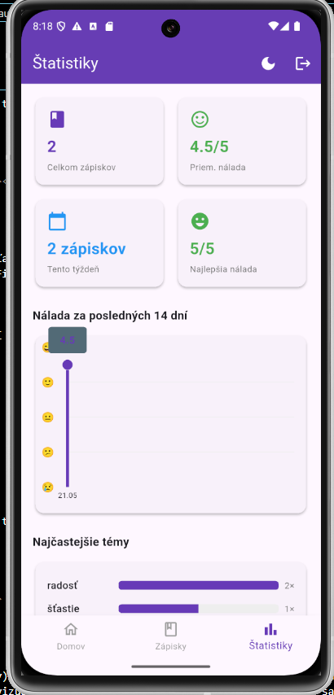<br>
      <b>Štatistiky</b>
    </td>
    <td width="50%" align="center">
      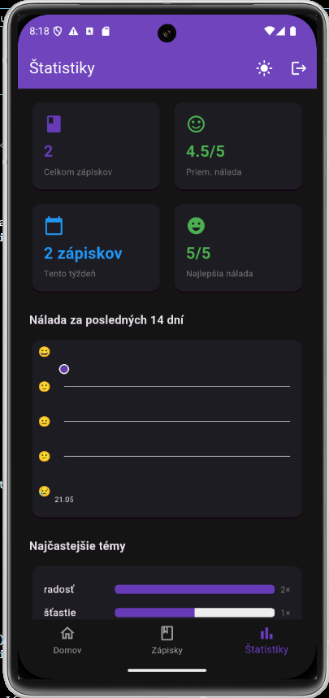<br>
      <b>Tmavá téma</b>
    </td>
  </tr>
</table>

**Štatistiky**   
Hore **4 farebné summary karty**: celkový počet zápiskov, priemerná nálada (s farbou podľa hodnoty), počet zápiskov tento týždeň a najlepšia dosiahnutá nálada. Pod kartami **Line chart nálady za 14 dní** – Y os má emoji namiesto číselných hodnôt, X os zobrazuje dátumy. Pod grafom **Top 5 najčastejších tém** s vizualizáciou cez progress bary – ukazuje koľkokrát sa tag vyskytol relatívne k najčastejšej téme.

**Tmavá téma** 
Aplikácia podporuje **prepínateľný tmavý režim** cez ikonu mesiaca/slnka v app bare. Tmavá téma využíva Material 3 dark theme s deepPurple seedColor – pozadie je tmavé, karty mierne svetlejšie, text biely. Toggle funguje globálne pre všetky obrazovky.

---

## 🤖 Reflexia LLM nástrojov

Podrobná reflexia využitia LLM nástrojov počas vývoja aj v samotnom produkte sa nachádza v samostatnom dokumente:

👉 **[docs/llm_reflection.md](docs/llm_reflection.md)**

Obsahuje úprimný popis použitých nástrojov, prínosy, limity, chronológiu problémov a poučení.

---

## 👤 Autor

**Samuel Gombárik**

GitHub: [@aaqwaar](https://github.com/aaqwaar)

Semestrálny projekt, máj 2026

---

## 📝 Poznámky

- Aplikácia je optimalizovaná pre **Android** (testované na Pixel 8a, API 35)
- iOS by mal fungovať tiež (FlutterFire podporuje), ale netestované
- AI funkcie vyžadujú aktívne internetové pripojenie
- Free tier Gemini má limit ~15 requestov/minútu, 1500/deň – pre osobné použitie dostatočné
