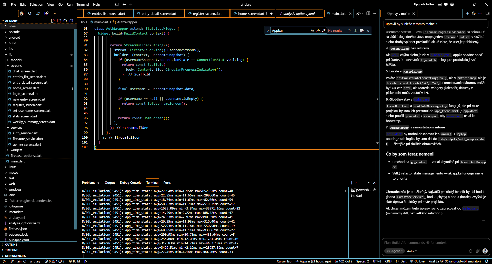
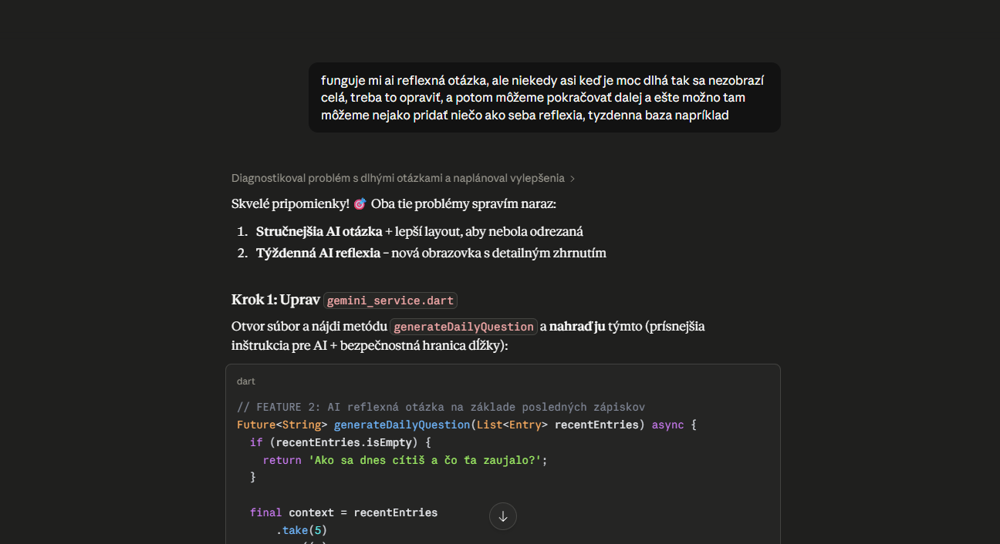

# Reflexia využitia LLM nástrojov v projekte AI Denník

> Tento dokument predstavuje povinný bod 6 zadania – úprimnú reflexiu využitia LLM nástrojov počas vývoja projektu aj v samotnom produkte. Reflexia obsahuje aj neúspechy, slepé uličky a limity, ktoré som počas práce zaznamenal.

---

## 1. Prehľad použitých LLM nástrojov

LLM nástroje boli v projekte použité **dvoma rôznymi spôsobmi** v súlade s bodom 4 zadania:

### 🛠 Vo vývoji – LLM ako asistent
- **Cursor IDE** s integrovaným modelom **Claude Sonnet 4.5** – hlavný kódovací editor
- **Claude (claude.ai)** v prehliadači – plánovanie, mentorovanie, debugging

### 🤖 V produkte – LLM ako runtime funkcionalita
- **Google Gemini 2.5 Flash API** – integrované priamo do mobilnej aplikácie pre 4 AI funkcie

---

## 2. LLM nástroje vo vývoji – detailný popis

### 2.1 Cursor IDE s Claude Sonnet 4.5

Cursor je fork Visual Studio Code s natívne zabudovaným AI asistentom. **Pred týmto projektom som ho nikdy nepoužíval** – dovtedy som pracoval v klasickom VS Code a Android Studio.

**Konkrétne použitie počas projektu:**
- **Inline generovanie kódu (Ctrl+K)** – pri písaní Flutter widgetov som označil prázdne riadky a popísal čo chcem (napr. *"vytvor card s ikonou a popisom"*). Cursor vygeneroval boilerplate kód.
- **Chat s kontextom celého projektu (Ctrl+L)** – AI videl všetky moje súbory, takže som sa mohol pýtať bez vysvetľovania (napr. *"prečo nefunguje to ukladanie tagov?"*).
- **Vysvetľovanie chybových hlášok** – pri červených erroroch v termináli som ich označil a opýtal sa *"čo toto znamená a ako to opraviť?"*. Toto mi ušetrilo desiatky minút hľadania na Stack Overflow.

**Prínosy:**
- Zrýchlilo kódenie boilerplate Flutter kódu (StatefulWidgets, Card layouty, dialógy) z minút na sekundy
- Kontext celého projektu znamenal, že AI vedel o všetkých mojich modeloch a službách bez potreby vysvetľovania
- Inline úpravy boli často presnejšie než kopírovanie kódu z chatu

**Limity:**
- Free verzia mala obmedzený počet "premium" requestov za mesiac
- Pri zložitejších úpravách občas generoval kód, ktorý "vyzeral OK", ale nezohľadňoval konkrétne závislosti v projekte
- Občas používal deprecated Flutter API (napr. `Colors.X.withOpacity()` namiesto `withValues(alpha:)`)

### 2.2 Claude (claude.ai) v prehliadači

Claude bol môj **hlavný mentor počas celého projektu**. Slúžil ako virtuálny senior developer, ktorý ma viedol krok po kroku.

**Konkrétne použitie:**
- **Plánovanie projektu od nuly** – diskusia o vhodných nápadoch na semestrálny projekt, výber technológií (Flutter + Firebase), návrh štruktúry priečinkov, plán na jeden deň práce
- **Krok-po-krok vedenie setupom** – inštalácia Flutter SDK, Android Studio, Node.js, Firebase CLI, FlutterFire CLI, Android emulátora. Claude mi posielal presné príkazy a riešil problémy v reálnom čase cez screenshoty terminálu.
- **Debugging cez screenshoty** – pri chybách som odfotil terminál alebo červenú obrazovku emulátora a Claude analyzoval príčinu (často so správnou odpoveďou na prvý pokus).
- **Architektonické rozhodnutia** – výber medzi Anthropic Claude API vs Google Gemini, ako implementovať týždennú reflexiu, či ukladať chat históriu do Firestore.
- **Generovanie kompletných obrazoviek** – kde Cursor robil kratšie úryvky, Claude vedel napísať celé `.dart` súbory pripravené na použitie (login, register, chat screen, weekly reflection screen).
- **Mentorovanie reflexie** – pri písaní tohto dokumentu mi pomáhal štruktúrovať myšlienky a pripomínal mi problémy, ktoré sme spolu riešili.

**Prínosy:**
- Šetril čas pri hľadaní riešení – jedna otázka namiesto 30 minút na Stack Overflow
- Vysvetlenie kontextu – nielen *"tu je kód"* ale aj *"prečo to robíme takto"*
- Trpezlivosť pri opakovaných otázkach
- Pamätal si celý kontext projektu cez konverzáciu

**Limity:**
- Občas navrhol Firebase API call, ktorý v aktuálnej verzii balíka neexistoval (modely sa rýchlo menia)
- Nevidel runtime stav môjho projektu – musel som mu posielať screenshoty
- Pri Anthropic vs Gemini neistote (modely sa menia každý mesiac) mi neodporúčal vždy najaktuálnejšiu verziu

---

## 3. LLM v produkte – Gemini 2.5 Flash API

V samotnej aplikácii sme cez REST API integrovali **Google Gemini 2.5 Flash** pre 4 rôzne funkcie:

### Funkcia 1: Auto-tagovanie zápiskov
Pri uložení zápisku AI analyzuje text a extrahuje 2-3 hlavné témy. Tagy sa uložia do Firestore spolu so zápiskom a slúžia ako vizuálne štítky + pre štatistiky najčastejších tém.

**Prompt engineering:** Najťažšie bolo presvedčiť AI, aby vrátil **čistý JSON** bez markdown bloku ` ```json...``` `. Riešenie: striktný prompt + post-processing v Dart kóde (`replaceAll('```json', '')`).

### Funkcia 2: Denná reflexná otázka
Pri kliknutí na "Vygenerovať otázku" AI vytvorí **personalizovanú otázku** na zamyslenie podľa posledných 5 zápiskov. Príklad: *"Všimol som si, že posledné dni si často spomínal stres v práci. Čo by ti dnes pomohlo si oddýchnuť?"*

### Funkcia 3: Chat s denníkom
Užívateľ sa môže pýtať AI otázky o svojich zápiskoch. AI dostáva ako kontext posledných 20 zápiskov a odpovedá osobne. **Chat história sa ukladá do Firestore** (subkolekcia `chat_messages`), takže pri opätovnom otvorení appky je konverzácia zachovaná.

### Funkcia 4: Týždenná self-reflexia
AI vygeneruje **štruktúrované zhrnutie** posledného týždňa so 4 sekciami:
- 📊 Prehľad týždňa
- 🎯 Hlavné témy
- 💡 Pozorovania
- 🌱 Odporúčania na ďalší týždeň

---

## 4. Chronologický zoznam problémov a ich riešení

Toto je **úprimný zoznam všetkých chýb**, na ktoré som počas projektu narazil, a ako som ich vyriešil. Bez pomoci LLM by mnohé z nich zabrali dni vlastným hľadaním na fórach.

### Setup a konfigurácia prostredia

**❌ Problém 1: Android SDK verzia konflikt**
`flutter doctor` hlásil: *"Flutter requires Android SDK 36 and Android BuildTools 28.0.3"*. Mal som nainštalovanú verziu 35.
**✅ Riešenie:** Cez Android Studio SDK Manager nainštalovať API 36. Spustiť `flutter doctor --android-licenses` na akceptovanie licencií.

**❌ Problém 2: Node.js nebol nainštalovaný**
Pri pokuse o `npm install -g firebase-tools` PowerShell hlásil *"node is not recognized as the name of a cmdlet"*.
**✅ Riešenie:** Stiahnuť a nainštalovať Node.js LTS verziu z nodejs.org. Reštart Cursora pre prevzatie nového PATH.

**❌ Problém 3: PowerShell execution policy**
Po inštalácii Node.js sa `npm` nedalo spustiť: *"npm.ps1 cannot be loaded because running scripts is disabled on this system. UnauthorizedAccess."*
**✅ Riešenie:** `Set-ExecutionPolicy -ExecutionPolicy RemoteSigned -Scope CurrentUser`. Klasická Windows prekážka, ktorú by som bez Clauda hľadal hodiny.

**❌ Problém 4: FlutterFire CLI mimo PATH**
Po `dart pub global activate flutterfire_cli` warning hovoril, že `C:\Users\admin\AppData\Local\Pub\Cache\bin` nie je na PATH. Príkaz `flutterfire` nefungoval.
**✅ Riešenie:** Pridať cestu trvalo cez PowerShell `[Environment]::SetEnvironmentVariable(...)`. Pre okamžitý efekt v aktuálnej session: `$env:Path += ";..."`.

### Flutter a Dart špecifické problémy

**❌ Problém 5: Locale data not initialized**
Pri prvom otvorení tabu "Zápisky" appka padala s červenou obrazovkou: *"LocaleDataException: Locale data has not been initialized"*. Používal som `DateFormat('d. MMMM yyyy', 'sk')`.
**✅ Riešenie:** Pridať `await initializeDateFormatting('sk');` v `main()` PRED `runApp()`. Navyše hot restart (`R`) nestačil – musel som spraviť plný reštart (`q` + `flutter run`).

**❌ Problém 6: Hot restart vs hot reload pri zmenách v main.dart**
Pri zmenách v `main.dart` hot reload (`r`) nezachytil zmenu. Naučil som sa rozdiel: `r` = hot reload (zachová stav, prejaví len UI zmeny), `R` = hot restart (re-run `main()`), `q` + `flutter run` = plný reštart (potrebný pri zmenách v `main()` alebo `.env`).

**❌ Problém 7: .env súbor v zlom kódovaní (UTF-16 BOM)**
Appka padala pri štarte: *"FormatException: Invalid UTF-8 byte (at offset 0)"*. Príčina: vytvoril som `.env` cez `echo GEMINI_API_KEY=... > .env` v PowerShelli, ktorý súbor uložil ako UTF-16 LE s BOM značkou.
**✅ Riešenie:** Vymazať `.env` a vytvoriť ho **priamo v Cursor editore** (Cursor ukladá ako UTF-8 bez BOM). Klasická Windows pasca.

### Gemini API problémy

**❌ Problém 8: Gemini model `gemini-2.0-flash` deprecated**
Prvé volania API vracali HTTP 429 s chybou *"limit: 0, model: gemini-2.0-flash"*. Limit 0 = model nemá free tier.
**✅ Riešenie:** Pridať debug výpisy s emoji (🔑📡📥❌) do `_generateContent` metódy, vidieť presnú odpoveď servera, identifikovať že treba prejsť na **`gemini-2.5-flash`**.

**❌ Problém 9: AI generuje príliš dlhé odpovede napriek inštrukcii**
Aj keď som v prompte explicitne napísal *"PRÍSNE PRAVIDLÁ: Maximálne 15 slov"*, AI niekedy vrátil dlhšiu odpoveď.
**✅ Riešenie:** Kombinácia prísneho promptu + **programovej bezpečnostnej hranice** v Dart kóde (string truncation). Naučenie: LLM treba "obaliť" defenzívnym kódom, nestačí mu len veriť.

**❌ Problém 10: Gemini 2.5 "thinking mode" mínal tokeny**
Denná otázka aj po zvýšení `maxOutputTokens` na 300 prichádzala **odrezaná uprostred slova** (*"Čo konkrét..."* namiesto celej otázky). Gemini 2.5 má interný "thinking" režim, ktorý míňa tokeny na "premýšľanie" pred samotnou odpoveďou.
**✅ Riešenie:** Pridať `thinkingConfig: { thinkingBudget: 0 }` do `generationConfig`. Toto vypne premýšľanie a celé `maxOutputTokens` sa použije pre samotnú odpoveď.

**❌ Problém 11: HTTP 429 – rate limit free tieru**
Free tier Gemini 2.5 Flash má limity: ~15-20 requestov za minútu a 1500 za deň. Pri rýchlom testovaní sa limit ľahko prekročí.
**✅ Riešenie:** Viaceré opatrenia:
- Lepšie error messages (`if (e.toString().contains('429')) { ... }`) aby užívateľ vedel, že to je dočasné
- **Manuálne generovanie dennej otázky** namiesto automatického pri každom otvorení tabu – ušetrí ~70% requestov
- **Ukladanie chat histórie** do Firestore – netreba znova posielať tie isté otázky
- Pri rate limit error sa zápisok aj tak uloží, len bez AI tagov (graceful degradation)

**❌ Problém 12: HTTP 503 – Gemini server preťažený**
Pri rýchlom testovaní príležitostne vrátil *"This model is currently experiencing high demand."*
**✅ Riešenie:** Nič kódovo – počkať pár minút. Pridať však fallback správu v UI. Naučenie: pri integrácii LLM API treba počítať s občasnou nedostupnosťou.

**❌ Problém 13: Tiché zlyhania v kóde**
Pôvodne catch bloky v GeminiService potichu vracali prázdne hodnoty bez ladiacej správy. Zápisok sa uložil s prázdnymi tagmi a nikto nevedel prečo.
**✅ Riešenie:** Pridať `print()` výpisy v catch blokoch (s emoji ❌ pre prehľadnosť). Neskôr vylepšiť error messages priamo v UI – pri zlyhaní AI tagovania sa zobrazí oranžový snackbar *"Zápisok uložený, ale AI tagy sa nepodarilo vygenerovať..."*.

**❌ Problém 14: HTTP 403 CONSUMER_SUSPENDED – API kľúč suspendovaný**
Po intenzívnom testovaní Google **automaticky suspendoval** môj druhý Gemini API kľúč (z alternatívneho účtu). Toto je závažnejšie ako rate limit – kľúč prestal fungovať trvalo.
**✅ Riešenie:** Vytvoriť nový kľúč v ďalšom Google účte + opatrnejšie testovanie. **Naučenie:** Free tier API kľúče sú **veľmi krehké** pre intenzívny development. V produkcii by sa toto riešilo cez backend (Cloud Functions) s riadnym billingom.

**❌ Problém 15: `.env` zmeny vyžadujú plný reštart**
Pri zmene API kľúča v `.env` súbore nestačil hot restart (`R`) – `flutter_dotenv` načítava súbor len pri prvom štarte aplikácie. Musel som úplne ukončiť proces (`q`) a opätovne spustiť cez `flutter run`.

---

## 5. Čo som sa pri práci s LLM nástrojmi naučil

### 5.1 Promptovanie je samostatná zručnosť
- Čím **konkrétnejší prompt**, tým lepší výsledok. *"Vygeneruj tagy"* je príliš všeobecné. *"Vráť LEN JSON pole 2-3 jednoslovných tagov v slovenčine, malými písmenami, bez ďalšieho textu"* je oveľa lepšie.
- Pri štruktúrovaných výstupoch (JSON) treba **prompt + post-processing** – LLM nikdy nie je 100% spoľahlivé.
- Príklady v prompte (*"Príklad: [práca, stres]"*) pomáhajú modelu pochopiť formát.

### 5.2 LLM ako debug asistent je revolúcia
- Namiesto hľadania na Stack Overflow stačí skopírovať error a opýtať sa Cursoru/Claude. **Väčšina problémov vyriešená do 2 minút.**
- Posielanie screenshotov terminálu Claude bolo extrémne efektívne – AI vie identifikovať aj problémy, ktoré nesúvisia priamo s otázkou.

### 5.3 Error handling pri LLM API je kritický
- LLM API môžu kedykoľvek vrátiť chybu (rate limit, server overload, suspended key, neplatný response)
- Appka musí počítať s týmto – **graceful degradation** je dôležitejší než pri klasických API
- V mojej appke: zápisok sa uloží aj keď AI tagovanie zlyhá, chat má fallback správy, denná otázka má default text

### 5.4 Modely sa rýchlo menia
- Pôvodne som plánoval `gemini-2.0-flash` (podľa staršej dokumentácie), ale ten bol odložený z free tieru
- `gemini-2.5-flash` priniesol "thinking" feature, ktorá nečakane mínala tokeny
- **Lesson:** Verify the current model pred použitím, nespoľahnúť sa na 6-mesačnú dokumentáciu

### 5.5 Voľba medzi LLM API – cenový faktor
Pôvodne som zvažoval **Anthropic Claude API**, ale po porovnaní som zvolil **Google Gemini**:

| | Anthropic Claude | **Google Gemini (vybraté)** |
|---|---|---|
| Cena | Platený (~$0.01/test) | **Zadarmo (1500 req/deň)** |
| Karta pri registrácii | Treba | **Netreba** |
| Kvalita pre náš use case | Skvelá | Skvelá |
| Setup | Jednoduché | Jednoduché |

Pre študentský projekt a verejné API kľúče bolo zadarmo riešenie jasnou voľbou.

### 5.6 LLM ako učiteľ, nie len ako tool
Najväčšie poučenie projektu: **LLM nie sú zázračný nástroj, ktorý spraví prácu za teba**. Sú **zosilňovač** tvojich schopností. Treba vedieť, čo chceš, vedieť pochopiť čo AI navrhuje, a vedieť rozoznať keď sa AI mýli. Najlepšie sa to dá využiť keď s AI **komunikuješ ako so seniorom** – povieš mu kontext, opýtaš sa, kriticky vyhodnotíš odpoveď.

---

## 6. Limity LLM nástrojov (úprimné zhodnotenie)

### 6.1 LLM nie sú neomylné
- Cursor generoval kód s `withOpacity()` (deprecated v novšom Flutteri) namiesto `withValues(alpha:)`. Musel som ručne opraviť viackrát.
- Claude občas navrhol Firebase API call, ktorý v aktuálnej verzii balíka neexistoval.
- Gemini občas vrátil čistý text namiesto JSON, aj keď bol o JSON explicitne prosený.

### 6.2 LLM nevie o tvojom kontexte
- Cursor síce vidí kód, ale **nevidí runtime stav** (čo je v Firestore, aký je obsah `.env`, ktorý emulátor beží)
- Pri zložitých chybách (UTF-16 BOM v `.env`) som **musel pochopiť o čom hovorí**, nielen skopírovať jeho odpoveď

### 6.3 Tiché chyby v generovanom kóde
- Najnebezpečnejšie boli tiché chyby – kód, ktorý sa skompiluje a "funguje", ale logika je zlá
- Príklad: catch bloky tiché vracajúce prázdne hodnoty bez logu. Funguje, ale debugovanie je peklo.

### 6.4 Závislosť od pripojenia a kreditov
- Bez internetu Cursor AI nefunguje. Bez kreditu Anthropic API nefunguje.
- Free tier limity (Gemini) sú **reálne obmedzenie pri testovaní**, ale pri reálnom použití (užívateľ pridáva 1-2 zápisky denne) nehrozia.

---

## 7. Architektonické limity a možnosti rozšírenia

Počas vývoja som si uvedomil dôležitú architektonickú limitáciu môjho riešenia:

**Súčasná architektúra:** Aplikácia volá Gemini API priamo z klienta, používajúc môj jediný API kľúč zo súboru `.env`. To znamená, že **všetci užívatelia by zdieľali jednu quotu** (1500 requestov/deň). Pre osobné použitie alebo demo to stačí, ale pre reálnu produkciu by aplikácia po niekoľkých aktívnych užívateľoch prestala fungovať.

### Možné riešenia v produkcii

**Možnosť 1 – Vlastný API kľúč na užívateľa**
Pri prvom prihlásení by si každý užívateľ vytvoril vlastný Gemini API kľúč v Google AI Studio a vložil ho do nastavení appky. Každý by mal vlastných 1500 requestov/deň zadarmo.
*Výhody:* Žiadne náklady pre prevádzkovateľa appky.
*Nevýhody:* Technicky náročnejší onboarding.

**Možnosť 2 – Firebase Cloud Functions ako proxy**
Cloud Function by volala Gemini API namiesto klienta, s API kľúčom uloženým v secrets. Klient by volal len moju Cloud Function.
*Výhody:* Bezpečnosť (kľúč nie je v APK), možnosť per-user quoty.
*Nevýhody:* Vyžaduje upgrade Firebase na Blaze plán, náklady za každé volanie.

**Možnosť 3 – Aktivovať platený tier Gemini**
V Google AI Studio aktivovať billing. Limity sa zvýšia rádovo (desaťtisíce req/deň), platí sa za skutočné použitie (~$0.30 / milión tokenov).

**Poučenie:** Toto je typický prípad pri integrácii akéhokoľvek externého API – treba premyslieť **business model** ešte pred technickou implementáciou. V mojom prípade som sa zameral na technickú funkcionalitu; architektúru pre produkciu by som musel riešiť v ďalšej iterácii.

---

## 8. Snímky obrazoviek z používania LLM nástrojov


### Cursor IDE pri kódení
    

### Claude chat pri debuggovaní


---

## 9. Záverečné zhodnotenie

LLM nástroje **dramaticky urýchlili** vývoj tohto projektu. Bez nich by som setup Flutter + Firebase + FlutterFire + Gemini integráciu pravdepodobne nezvládol v rozumnom čase – jednotlivé prekážky (PATH, kódovanie, deprecated modely, thinking mode, suspended keys) by ma stáli dni hľadania.

### Najväčšie prínosy
- **Cursor IDE** – kódenie boilerplate Flutter zložiek za sekundy
- **Claude (chat)** – mentor, ktorý pochopil kontext projektu a viedol ma od nuly po hotový produkt
- **Gemini API** – umožnil pridať AI funkcie, ktoré by inak vyžadovali tréning vlastných modelov

### Najväčšie poučenia
1. **Verify always** – kód aj informácie od LLM treba overiť
2. **Defenzívne kódovanie** – LLM zlyhania sú normálne, počítaj s nimi
3. **Konkrétne prompty + post-processing** – kombinácia funguje lepšie ako "dúfať"
4. **Debug výpisy sú zlato** – `print()` s emoji pri vývoji ušetria hodiny
5. **Free tier limity sú reálne** – plánuj s nimi pri democh
6. **API kľúče treba chrániť** – `.env` + `.gitignore` od začiatku, nie ako "fix neskôr"

### Osvojené nové nástroje a postupy
- **Cursor IDE** ako nový pracovný editor (predtým len VS Code)
- **FlutterFire CLI** pre Firebase integráciu
- **flutter_dotenv** pre správu API kľúčov
- **REST API komunikácia s LLM** (request building, response parsing, error handling)
- **Prompt engineering** – písanie efektívnych promptov so štruktúrovaným výstupom
- **Štruktúrovaný debugging cez emoji print statements**
- **Firebase Security Rules** pre per-user data isolation

### Záverečná myšlienka
Tento projekt mi ukázal, že **moderný software engineering sa rapidne mení**. LLM nástroje nie sú "trend ktorý prejde", ale **nová pracovná norma**. Senior developeri budúcnosti nebudú tí, ktorí najlepšie kódia – budú to tí, ktorí najlepšie **vedia spolupracovať s AI**, kriticky hodnotiť jej výstupy, a kombinovať jej rýchlosť s vlastným úsudkom. Tento projekt mi dal prvú reálnu skúsenosť s týmto workflow a verím, že to je len začiatok.

---

*Reflexia napísaná v máji 2026 ako súčasť semestrálneho projektu na predmete využívajúcom LLM nástroje.*
